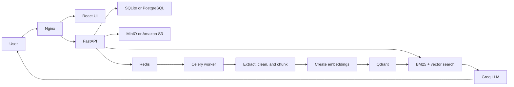

# Docflow

Docflow is a multi-user document question-answering application. Users can upload PDFs or images, organize files, create multiple chats, and ask questions about their own documents.

The application uses Retrieval-Augmented Generation (RAG). It searches the uploaded documents first and then gives the relevant text to the language model. This helps the model answer from the user's documents instead of relying only on its general knowledge.

For the complete AWS deployment instructions, see [CLOUD-SETUP-GUIDE.md](CLOUD-SETUP-GUIDE.md).

## Features

- User registration, login, logout, and bearer-token sessions
- Separate files, chats, and search results for every user
- PDF and image uploads
- Asynchronous document processing with Celery
- Text extraction from normal PDFs
- Tesseract OCR for scanned PDFs
- Optional image captioning through Hugging Face
- Cleanup of repeated slide headers, footers, page numbers, and duplicate text
- Parent and child document chunking
- Sentence-transformer embeddings
- Qdrant vector search
- BM25 keyword search
- Reciprocal Rank Fusion to combine vector and keyword results
- Multiple chats per user
- Conversation history for follow-up questions
- Source snippets returned with answers
- File deletion from S3/MinIO, Qdrant, and the metadata database
- React interface for files and chats
- Local Docker Compose setup
- AWS deployment using EC2, S3, PostgreSQL containers, and CloudWatch

## How It Works



### Upload flow

1. The API checks the file type and size.
2. The raw file is stored in MinIO locally or S3 in AWS.
3. File metadata is saved in SQLite or PostgreSQL.
4. A Celery task is added to Redis.
5. The worker extracts and cleans the document text.
6. The text is split into parent and child chunks.
7. Child chunks are embedded and stored in Qdrant.
8. The file status changes to `completed`.

### Query flow

1. The API loads recent messages from the selected chat.
2. Search is filtered using the authenticated user's ID.
3. BM25 finds exact keyword matches.
4. Qdrant finds semantically similar chunks.
5. Reciprocal Rank Fusion combines both result lists.
6. Parent chunks are sent to the Groq language model.
7. The answer and sources are returned and saved in chat history.

## User Isolation

Docflow is designed as a multi-tenant application.

- Every file row contains a `user_id`.
- Every chat and message belongs to one user.
- S3 object keys include the user and upload job IDs.
- Qdrant points contain `user_id` and `file_id` metadata.
- SQL queries and Qdrant searches filter by the current user.

This prevents one user from seeing another user's files, chats, or retrieved text.

## Main Techniques

- **Retrieval-Augmented Generation (RAG):** the application searches the user's files before asking the LLM to write an answer.
- **Parent-child chunking:** small child chunks improve search accuracy, while larger parent chunks give the LLM enough surrounding context.
- **Vector search:** sentence-transformer embeddings find text with a similar meaning, even when the exact words are different.
- **BM25 search:** keyword ranking helps with exact terms, names, formulas, and abbreviations.
- **Reciprocal Rank Fusion:** vector and BM25 rankings are combined without requiring both search methods to use the same score scale.
- **Conversation-aware retrieval:** recent chat messages help resolve follow-up words such as "it" or "that example." Retrieved document text still remains the main source.
- **Grounded fallback:** when the requested detail is not present in the uploaded files, the prompt asks the model to say so before giving a general explanation or its own example.

## Technology Stack

| Area | Technology | Purpose |
|---|---|---|
| Frontend | React, Vite, Lucide | User interface |
| API | FastAPI, Pydantic | HTTP endpoints and validation |
| Background work | Celery, Redis | Asynchronous document processing |
| Workflow | LangGraph | Document processing pipeline |
| Relational data | SQLite / PostgreSQL | Users, sessions, files, chats, messages |
| Object storage | MinIO / Amazon S3 | Raw uploaded documents |
| Vector storage | Qdrant | Embeddings and document chunks |
| Search | BM25, vector search, RRF | Hybrid document retrieval |
| Embeddings | sentence-transformers | Converts text into vectors |
| OCR | Tesseract, PyMuPDF | Reads scanned and normal PDFs |
| LLM | Groq through LangChain | Creates grounded answers |
| Observability | structlog, LangSmith, CloudWatch | Logs and pipeline tracing |
| Deployment | Docker, Nginx, AWS EC2 | Runs and exposes the application |

## Project Structure

```text
app/
  agents/       document classification, OCR, cleaning, chunking, embedding
  api/routes/   authentication, file, chat, and query endpoints
  core/         configuration and logging
  models/       API request and response models
  search/       BM25, vector search, and rank fusion
  storage/      S3/MinIO and Qdrant access
  workers/      Celery tasks
  db.py         SQLite and PostgreSQL database adapter

frontend/       React application
infra/          Dockerfiles, Compose files, and Nginx configuration
scripts/        helper scripts
tests/          backend unit and API tests
```

## Local Development

### Requirements

- Docker Desktop
- Docker Compose
- At least 8 GB RAM available to Docker
- Groq API key
- Hugging Face token if image captioning is enabled
- LangSmith key if tracing is enabled

### 1. Clone the repository

```bash
git clone https://github.com/JustATalentedGuy/docflow.git
cd docflow
```

### 2. Create the environment file

On Linux or macOS:

```bash
cp .env.example .env
```

On Windows PowerShell:

```powershell
Copy-Item .env.example .env
```

Open `.env` and replace only the placeholder API keys:

```env
GROQ_API_KEY=CHANGE_ME
HF_API_TOKEN=CHANGE_ME
LANGCHAIN_API_KEY=CHANGE_ME
```

Do not commit `.env`. It is excluded by `.gitignore`.

### 3. Start the application

```bash
docker compose -f infra/docker-compose.yml up --build -d
```

The first build can take several minutes because it downloads Python packages and the embedding model.

### 4. Open the application

- React UI: http://localhost
- Swagger API documentation: http://localhost/docs
- Health check: http://localhost/health
- MinIO console: http://localhost:9001
- Qdrant dashboard: http://localhost:6333/dashboard

Local MinIO credentials:

```text
Username: minioadmin
Password: minioadmin
```

These credentials are only for the local Docker environment.

### 5. View logs

```bash
docker compose -f infra/docker-compose.yml logs -f api worker
```

### 6. Stop the application

Keep stored data:

```bash
docker compose -f infra/docker-compose.yml down
```

Delete containers and local volumes:

```bash
docker compose -f infra/docker-compose.yml down -v
```

## API Summary

All user-data endpoints require:

```http
Authorization: Bearer <token>
```

| Method | Endpoint | Purpose |
|---|---|---|
| `POST` | `/api/v1/auth/register` | Register a user |
| `POST` | `/api/v1/auth/login` | Log in |
| `GET` | `/api/v1/auth/me` | Get the current user |
| `POST` | `/api/v1/auth/logout` | End user sessions |
| `POST` | `/api/v1/upload` | Upload a document |
| `GET` | `/api/v1/status/{job_id}` | Check processing status |
| `GET` | `/api/v1/files` | List the user's files |
| `DELETE` | `/api/v1/files/{file_id}` | Delete a file |
| `POST` | `/api/v1/chats` | Create a chat |
| `GET` | `/api/v1/chats` | List chats |
| `GET` | `/api/v1/chats/{chat_id}` | Load chat history |
| `POST` | `/api/v1/chats/{chat_id}/messages` | Ask a chat question |
| `DELETE` | `/api/v1/chats/{chat_id}` | Delete a chat |
| `POST` | `/api/v1/query` | Ask a one-time question |
| `GET` | `/health` | Check API health |

Interactive request and response documentation is available at `/docs`.

## Data Storage

### Relational database

The local environment uses SQLite. The AWS environment uses PostgreSQL inside Docker.

| Table | Stores |
|---|---|
| `users` | Email and password hash |
| `sessions` | Login tokens and expiry |
| `files` | File name, owner, S3 key, status, and size |
| `chats` | User chat threads |
| `messages` | User and assistant messages |

### Object storage

Raw files use this key format:

```text
uploads/{user_id}/{job_id}/{filename}
```

MinIO is used locally and private Amazon S3 is used in AWS.

### Vector storage

Qdrant stores:

- Parent and child chunks
- Embedding vectors
- User, file, and job IDs
- Filename and parent-child relationship

## Tests

Install Python dependencies:

```bash
python -m pip install -r requirements.txt
```

Run tests:

```bash
python -m pytest tests -v
```

Run the frontend build:

```bash
cd frontend
npm ci
npm run build
```

Some integration behavior requires Redis, Qdrant, external APIs, and the embedding model.

## AWS Deployment

The AWS demo architecture uses:

- One EC2 instance in a public subnet
- Nginx as the only public application port
- PostgreSQL, Redis, Qdrant, API, worker, and frontend containers
- Private S3 document storage
- EC2 IAM role credentials
- CloudWatch container logs
- EBS-backed Docker volumes

See [CLOUD-SETUP-GUIDE.md](CLOUD-SETUP-GUIDE.md) for the complete Windows, GitHub, VPC, IAM, EC2, Docker, deployment, debugging, demo, and teardown steps.

## Security Notes

- Real environment files are ignored by Git.
- AWS deployments use an EC2 IAM role instead of stored AWS access keys.
- S3 public access should remain blocked.
- PostgreSQL, Redis, Qdrant, and FastAPI are not exposed as EC2 host ports.
- The demo deployment uses HTTP. Use temporary demo accounts only.
- A production deployment should add HTTPS, managed secrets, database migrations, backups, and private subnets.

To report a security issue, read [SECURITY.md](SECURITY.md).

## Current Limitations

- The demo architecture runs on one EC2 instance and has one failure point.
- BM25 is kept in application memory and is not distributed.
- Authentication uses simple bearer sessions instead of OAuth or refresh-token rotation.
- The first query can be slow while the embedding model loads.
- The AWS demo uses HTTP unless a domain and TLS proxy are added.
- PostgreSQL and Qdrant backups are manual in the demo setup.

## License

This project is available under the [MIT License](LICENSE).

## Contributing

Create a branch, keep changes focused, run the backend tests and frontend build, and open a pull request. Never include local environment files, API keys, cloud account details, or uploaded documents in a commit.
